## Welcome to my GitHub profile!

keyboard signature generated by [cnrad/keyboard-signature](https://github.com/cnrad/keyboard-signature) btw

### About Me

I open source most of my coding projects here, though yes I do code HTML sites from scratch or templates, but I still mostly do web design rather than coding a website, you'd see many site repositories are designed with [Brizy Cloud](https://brizy.io/cloud) which is machine generated code, it's much easier that way for me to present my design.

Besides of these website designs, I also code certain Discord bots, mostly hosted on [Oracle Cloud Infrastructure](https://www.oracle.com/cloud), they offer **always free tier** which allows you to create a limited amount of VMs for your own sake of use!

**[Click here](https://rhsu.cc) to check out my main website!**

### My Basic Coding Information

- 🌱 I’m currently learning JavaScript

- 🔭 I’m currently working on [hackerman14 Discord bot](https://github.com/hackerman14/bot-code) and [class table teller](https://github.com/raymond-1227/whats-the-next-class)

- 🤔 I’m looking for help with the projects mentioned above

### Stats

